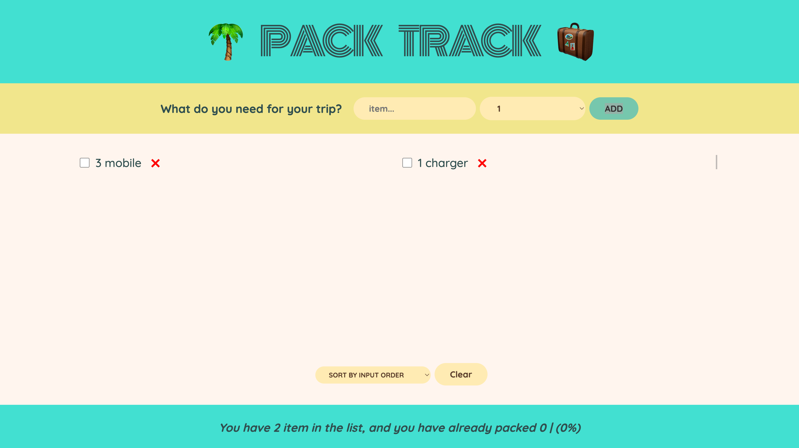

# Pack Track 🧳

Pack Track is a simple React application that helps you keep track of items you need to pack for your trip. You can add items, mark them as packed, and even sort them based on different criteria. The app also utilizes local storage to persist your items even after a page refresh.

## Features

- Utilizes local storage to save your items for future use.
- Add items with a description and quantity.
- Mark items as packed by checking the checkbox.
- Sort items by input order, description, or packed status.

## Image



## Getting Started

To run this project locally, follow these steps:

1. Clone the repository:

```bash
git clone https://github.com/pulak-sarmah/pack-track.git
```

2. Navigate to the project directory:

```bash
cd pack-track
```

3. Install the dependencies:

```bash
npm install
```

4. Start the development server:

```bash
npm run dev
```
